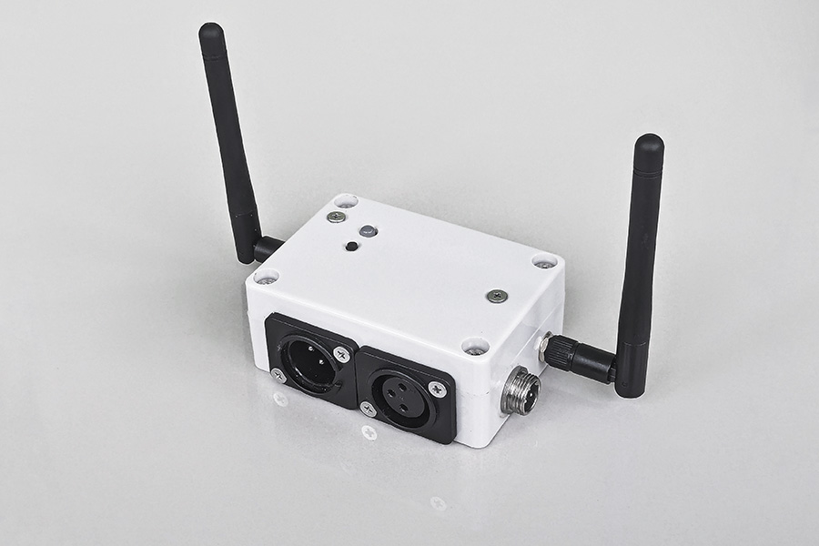
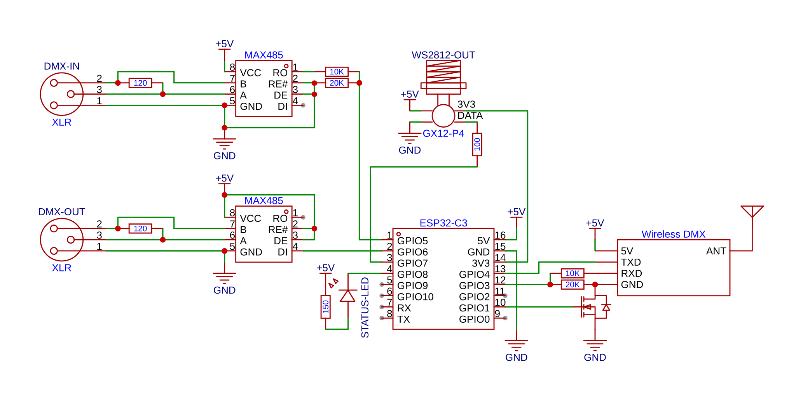

# Reference Hardware: The "Swiss Army Knife" DMX Controller

This document describes a reference hardware implementation of the ESP32-DMX gateway. This device is designed as a versatile, compact "Swiss Army Knife" for research, testing and professional lighting applications, capable of handling wired DMX, wireless DMX, and direct LED control.

## Hardware Overview

The reference device is built around the **ESP32-C3-SuperMini** development board, modified with an external antenna for superior WiFi range.

### Key Features
*   **Wired DMX Port:** One full-duplex DMX port with dual XLR connectors for easy daisy-chaining or signal sniffing.
*   **Wireless DMX:** Integrated 2.4GHz wireless DMX module with a dedicated channel selection button and LED indicator. Equipped with a separate external antenna providing up to **200m coverage**. Operates as either a transmitter or receiver (half-duplex).
*   **GX12 Expansion Port:** A 4-pin GX12 connector providing:
    *   **GND / 5V / 3.3V / DATA**
    *   **Versatile Power:** The device can be powered via this port, or it can provide power to an external LED strip if the device is powered via USB-C.
    *   **Direct 3.3V:** The 3.3V pin allows powering the ESP32 directly (bypassing the internal regulator). *Note: Do not use this pin to draw high current for external loads.*
*   **Built-in Status LED:** Provide system status and WiFi feedback.

---

## Pinout Configuration & Mapping

The following table describes the GPIO mapping for this reference implementation.

| Feature | GPIO | Direction | Notes |
| :--- | :--- | :--- | :--- |
| **DMX Port 1 (Wired) RX** | 5 | Input | Wired DMX Input |
| **DMX Port 1 (Wired) TX** | 6 | Output | Wired DMX Output |
| **DMX Port 2 (Wireless) RX** | 3 | Input | Wireless Module RX |
| **DMX Port 2 (Wireless) TX** | 4 | Output | Wireless Module TX |
| **DMX Port 2 (Wireless) Power** | 1 | Output | Wireless Module power control |
| **WS2812 Data** | 7 | Output | Connected to GX12 expansion port |
| **Status LED** | 8 | Output | Built-in LED (Active Low) |
| **Available / Expansion** | 0 | - | Free for 2nd WS2812 or TXEN |
| **Available / Expansion** | 10 | - | Free for 2nd WS2812 or TXEN |

### Critical Pin Usage Notices

*   **Bootstrapping Pins (2, 8, 9):** These pins are sampled during the ESP32-C3 boot process. To ensure the device starts correctly, **avoid** connecting external peripherals that might pull these pins high or low during power-on.
*   **Status LED (GPIO 8):** This pin is the built-in LED on the SuperMini board. It is used as a bootstrapping pin; keep its load minimal.
*   **UART0 & Logging (GPIO 20, 21):** By default, ESP32-C3 outputs bootloader logs to GPIO 20/21. Once the firmware starts, logs are redirected to the **USB-JTAG interface**, and UART0 is reconfigured to use pins 3 and 4 for DMX. However, **avoid using pins 20 and 21** for sensitive peripherals to prevent glitches during the boot sequence.

---

## Schematic

*   **Logic Levels:** All RX lines use 10k/20k voltage dividers to safely interface 5V RS485 transceivers with 3.3V GPIOs.
*   **LED Protection:** The WS2812 data line includes a 100Ω series resistor.
